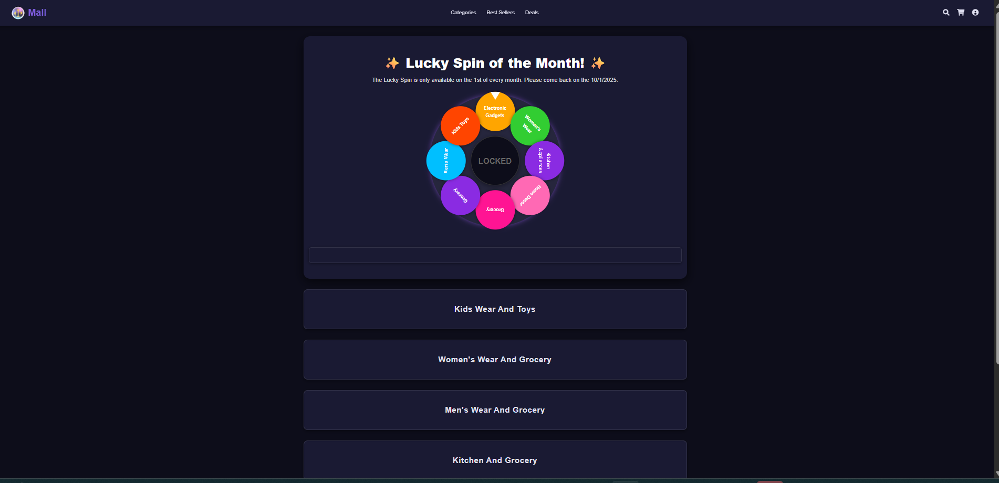
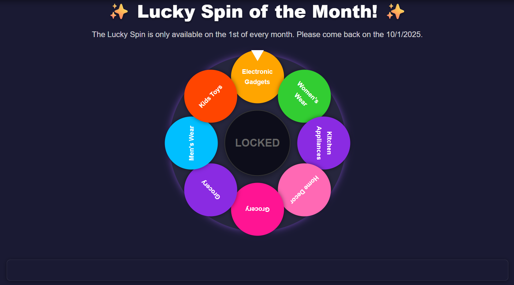
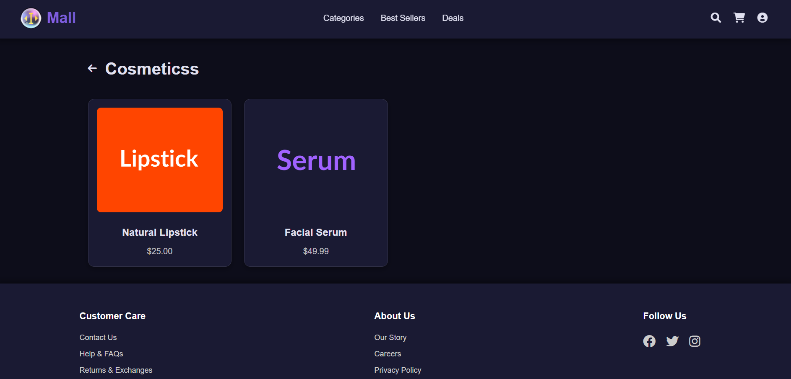

# 🛒 I_Mall – Frontend Project  

  

## 📌 Project Overview  
I_Mall is a **frontend project** that simulates an online mall interface with product categories, Lucky Spin discounts, and account creation functionality.  

---

## 🚀 Features  
- 🏬 Mall-style home page with logo and product categories  
- 🎡 Lucky Spin discount feature  
- 🛍️ Product display section  
- 👤 Account creation form  
- 🎨 Custom CSS design  

---

## 📸 Screenshots  

| Home Page | Lucky Spin | Products |
|-----------|------------|----------|
|  |  |  |  

---

## 🎥 Demo GIF  
  

---

## 🔮 Future Improvements  
- Add JavaScript for full interactivity  
- Dynamic product listing from backend  
- Shopping cart functionality  
- User authentication system  

---

## 👨‍💻 Author  
**Indra Kumar**  
Final-year B.E. Artificial Intelligence & Machine Learning  

---
